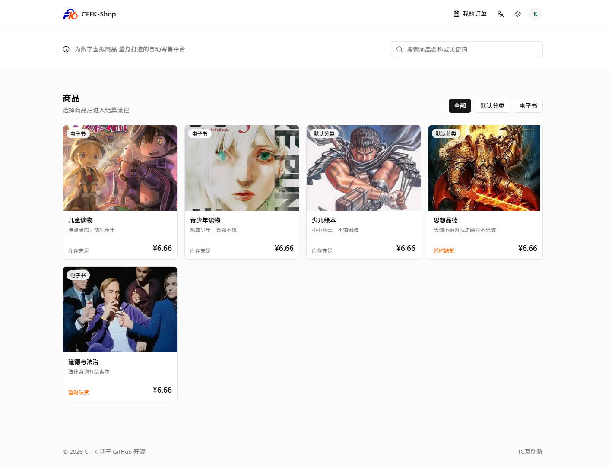
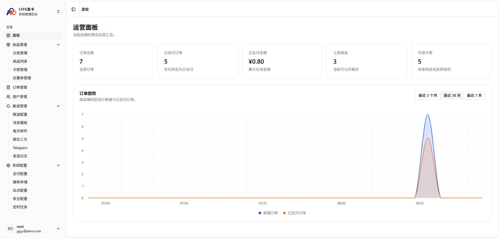
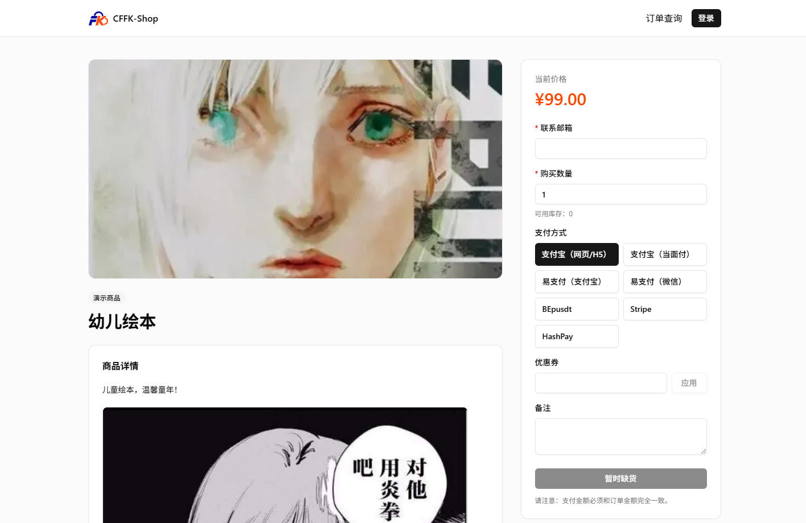
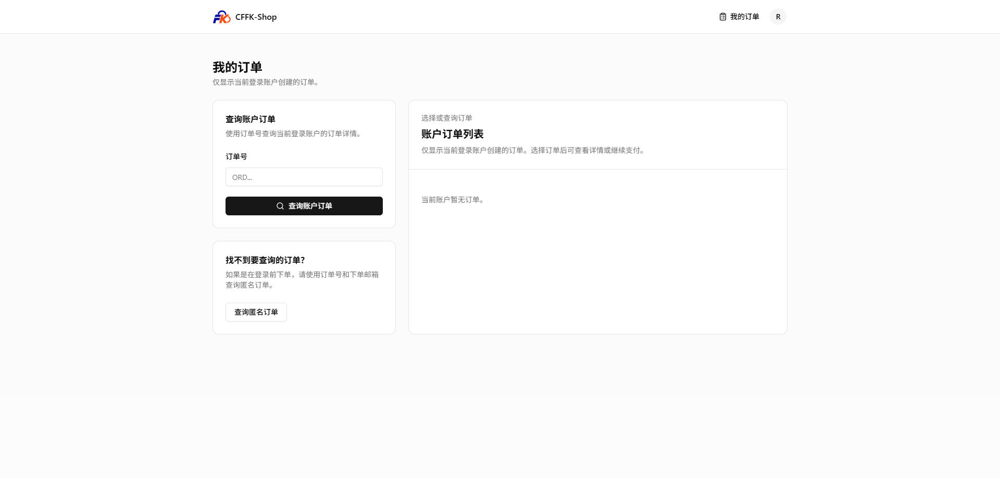
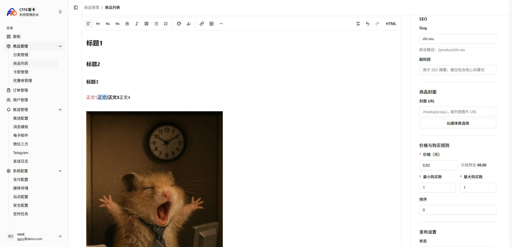
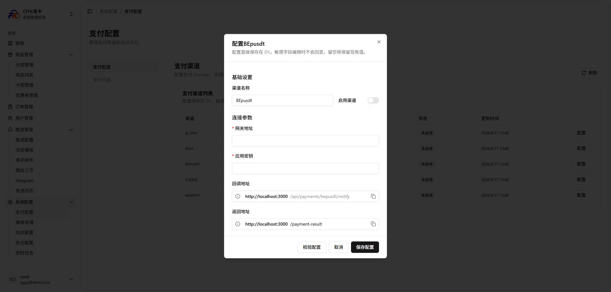
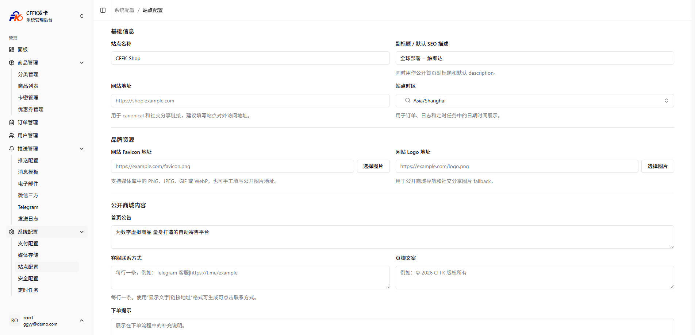
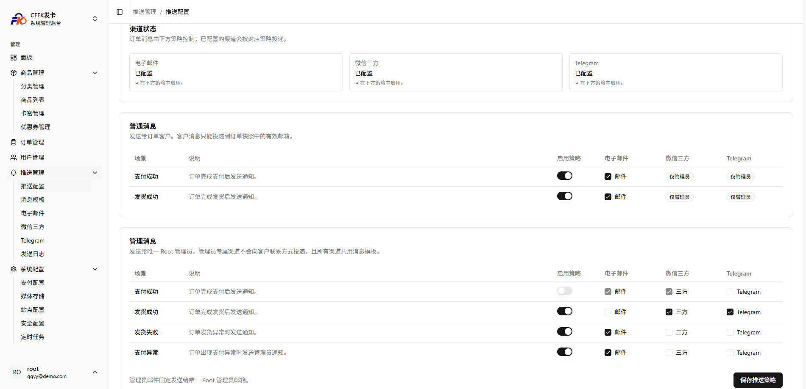
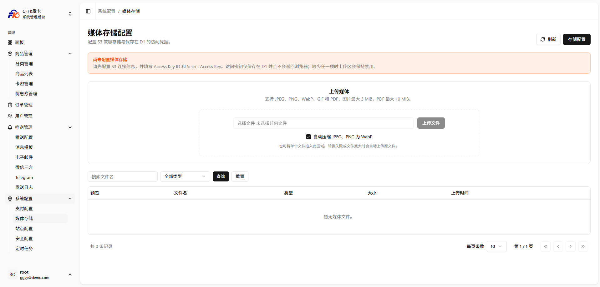
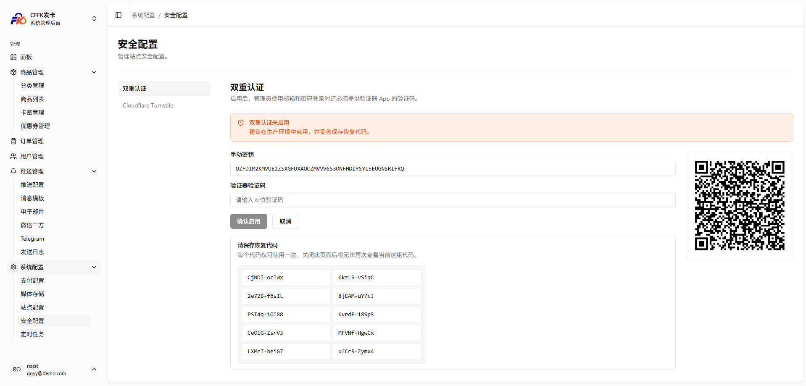

**❗️项目声明：本项目为开源的数字商品商城系统，仅供学习、研究与合法业务使用。请遵守所在地法律法规及支付服务商规则；项目作者及贡献者不对使用本项目开展的第三方交易、内容或服务承担责任。遇到问题请通过 GitHub 提交 `issue`，请勿将开源项目用于违法违规用途。**

---

# CFFK

<p align="center">
  基于 Cloudflare Workers 的轻量级数字商品商城与管理后台
</p>

<p align="center">
  <a href="https://github.com/34892002/cffk/blob/main/LICENSE">
    
  </a>
  <a href="https://github.com/34892002/cffk/stargazers">
    
  </a>
</p>

## 🪧 介绍

CFFK 是一个运行在 **Cloudflare Workers** 上的数字商品商城系统，集成商品展示、订单支付、自动发卡、人工与实物发货、用户账户、消息推送及运营后台。项目使用 Cloudflare D1 保存数据，适合部署个人商店或轻量级数字商品销售站点。

[在线预览](https://cffk.deepseek8.de/)

CFFK 脱胎于 [EdgeKey]，是其升级版：在继承 EdgeKey 一体化全栈商城、Cloudflare 边缘部署、商品与卡密管理等核心积累的基础上，重构并扩展了认证、订单履约、支付、推送、媒体管理和后台运营能力。

[一键免费部署到 Cloudflare Workers，3 分钟拥有一个发卡站。](#-一键部署到-cloudflare-workers)

## 页面展示
> 前台商城


    
> 后台管理



## 🎉 核心特性

- ✅ **Cloudflare Workers 部署**：一键部署、流水线更新版本
- ✅ **完整商品体系**：分类、商品上下架、富文本详情、封面图、购买限额与优惠券
- ✅ **上游供应商管理**：支持独角Next、二次元发卡供应商、上游商品导入、供应商绑定、库存与成本同步及自动履约发货
- ✅ **多种交付方式**：卡密自动发货、固定内容发货、人工发货与实物快递发货
- ✅ **支付渠道集成**：支持支付宝、易支付、BEpusdt、Stripe 与 HashPay
- ✅ **订单保障**：支付回调验证、支付日志、超时订单自动关闭与库存/优惠券释放
- ✅ **会员与访客订单**：邮箱密码注册登录、双因素认证、订单查询与访客订单找回
- ✅ **消息通知**：邮件、Telegram、微信三方渠道；支持模板、测试、重试及发送日志
- ✅ **媒体库**：兼容 S3 的对象存储，支持图片与 PDF 上传、站内代理访问及缓存
- ✅ **安全后台**：随机管理路径、首位管理员初始化、敏感配置脱敏保存

## 🆚 与 EdgeKey 的对比

CFFK 延续 EdgeKey 的 Cloudflare 全栈商城定位，并在现有能力上进行了升级：

| 模块 | EdgeKey | CFFK |
| --- | --- | --- |
| 框架 | Vike Prisma daisyUI | Vike Drizzle shadcn 重构 |
| 多语言 | 简体 | 简体 繁体 英文 |
| UI设计 | 使用 daisyUI 自定义组件略有差异 | 全站使用 shadcn 组件重构，统一使用标准UI，交互优化，黑暗模式 |
| 商品与库存 | 多种商品自动发货 | 完整支持 |
| 订单查询 | 浏览器缓存历史订单，订单号 + token 查询 | 浏览器缓存历史订单，邮箱 + 订单号(不可预测) 查询，注册用户服务器保存历史订单 |
| 支付 | 支付宝、易支付、BEpusdt、Stripe、HashPay | 完整支持，配置交互UI优化 |
| 用户体系 | 轻量化，不支持用户注册 | 用户体系，方便用户购物增加复购 |
| 消息通知 | SMTP、API、Cloudflare Email | 完整支持，新增Telegram、微信三方通知；更完善的发送日志 |
| 媒体资源 | 可接入外部图床 / S3 存储 | 完整支持，文件组件优化 |
| SEO | title / description、站点自定义 head 代码 | 完整支持，新增 动态 canonical、商品级 title / description、Open Graph、Twitter Card、社交分享图 |
| 后台运营 | 商品、订单、支付及站点设置 | 完整支持，增加运营面板、用户管理、推送配置 |
| 版本更新 | git命令更新部署，命令行操作 | 流水线部署，github点击按钮更新 |

> EdgeKey 与 CFFK 为独立项目。CFFK 基于 EdgeKey 的经验继续演进，不影响 EdgeKey 的正常使用和维护。

## 🚀 一键部署到 Cloudflare Workers

[](https://deploy.workers.cloudflare.com/?url=https://github.com/34892002/cffk)

[查看 Cloudflare 部署图文教程](./docs/imgs/wiki/deploy.jpg)

点击按钮后按部署页面提示创建 D1 数据库，并配置以下变量：

| 变量 | 类型 | 说明 |
| --- | --- | --- |
| `ADMIN_PATH` | 普通变量 | 后台访问路径，请填写难以猜测的随机字符串，**不含** `/`，例如 `admin-3q9527ko8`。 |
| `BETTER_AUTH_SECRET` | Secret | 登录会话签名密钥。请使用强随机值，可通过 `openssl rand -base64 32` 生成。 |
| `TURNSTILE_SITE_KEY` | 可选普通变量 | Cloudflare Turnstile 站点密钥；启用验证码时必须同时配置 Secret。 |
| `TURNSTILE_SECRET_KEY` | 可选 Secret | Cloudflare Turnstile 密钥；启用验证码时必须同时配置站点密钥。 |

部署完成后：

1. 打开 `https://你的Workers域名/setup`，创建首个 root 管理员账号。初始化完成后该页面将不可再次创建管理员。
2. 访问 `https://你的Workers域名/${ADMIN_PATH}`，使用刚创建的账号登录后台。
3. 进入 `/${ADMIN_PATH}/dash`，先在 **系统配置 → 站点配置** 中完善站点名称、公开地址、公告、客服方式和页脚信息。
4. 配置支付渠道、创建商品并导入卡密或设置发货方式，即可开始使用。

> 一键部署时请保持 `wrangler.jsonc` 中 D1 的 `database_id` 注释状态，由 Cloudflare 部署流程创建和绑定数据库。

### 更新 CFFK 版本

一键部署会在你的 GitHub 账号下创建独立仓库。后续可使用 GitHub Actions 从上游仓库同步 CFFK 的最新版本。

> [!IMPORTANT]
> 出于 GitHub 安全限制，一键部署创建的仓库**不会自动包含 GitHub Actions 工作流**。请先在你的仓库中手动创建 `.github/workflows/update-cffk.yml`，并复制本项目的 [更新工作流内容](https://github.com/34892002/cffk/blob/main/.github/workflows/update-cffk.yml) 后提交。

首次添加完成后：

1. 打开你自己的 GitHub 仓库，进入 **Actions**。
2. 选择 **Update CFFK** 工作流。
3. 点击 **Run workflow**，确认目标分支后运行。
4. 工作流会拉取 `34892002/cffk` 的 `main` 分支并推送到你的仓库；Cloudflare 的 Git 集成会自动检测提交并重新部署。

[查看 GitHub Actions 更新图文教程](./docs/imgs/wiki/actions1.jpg)

该工作流会保留你仓库当前的 `wrangler.jsonc`，以避免覆盖 D1 绑定和部署配置；除该文件外，上游同步会覆盖其他未合并的本地改动。对源码做过二次开发时，请先备份或通过分支、PR 合并更新。

## 📃 技术文档

- [开发规范](./docs/dev.md)
- [共用组件规范](./docs/components.md)
- [Cloudflare Workers 文档](https://developers.cloudflare.com/workers/)
- [Cloudflare D1 文档](https://developers.cloudflare.com/d1/)

### 本地开发

环境要求：Node.js 20+、bun，以及用于本地 D1 的 Wrangler。

```bash
bun i                # 安装项目依赖
bun db:generate      # 已执行迁移 0000_initial.sql 后可跳过；仅修改 schema.ts 后才需要生成新迁移
bun db:migrate:local # 将 migration 应用到本地 Wrangler D1 模拟数据库
bun db:seed:local    # 导入本地默认数据
bun dev              # 启动本地开发服务器
```

默认访问地址为 <http://localhost:3000>。本地开发变量写入未提交的 `.dev.vars`：

```ini
ADMIN_PATH=admin
BETTER_AUTH_SECRET=local-development-secret
# TURNSTILE_SITE_KEY=your-site-key
# TURNSTILE_SECRET_KEY=your-secret-key
```

常用命令：

```bash
bun run lint              # ESLint 检查
bun run db:check          # 检查 Drizzle migration
bun run build             # 生成 migration 并构建
bun run db:migrate:remote # 应用远程 D1 migration
bun run deploy            # 迁移、导入默认数据并部署
```

## 🖼 功能截图

| 商城首页 | 商品详情 | 订单查询 |
| --- | --- | --- |
| <a href="./docs/imgs/shop.jpg" target="_blank"></a> | <a href="./docs/imgs/shop1.jpg" target="_blank"></a> | <a href="./docs/imgs/order.jpg" target="_blank"></a> |

| 创建商品 | 支付配置 | 站点配置 |
| --- | --- | --- |
| <a href="./docs/imgs/product.jpg" target="_blank"></a> | <a href="./docs/imgs/pay.jpg" target="_blank"></a> | <a href="./docs/imgs/settings.jpg" target="_blank"></a> |

| 消息推送 | 媒体存储 | 安全配置 |
| --- | --- | --- |
| <a href="./docs/imgs/push.jpg" target="_blank"></a> | <a href="./docs/imgs/media.jpg" target="_blank"></a> | <a href="./docs/imgs/security.jpg" target="_blank"></a> |

## 🔧 技术栈

- **前端**：Vike、Vue 3、Vite、Tailwind CSS、shadcn-vue
- **服务端**：Hono + Cloudflare Workers
- **数据库**：Cloudflare D1 + Drizzle ORM
- **认证**：Better Auth（邮箱密码与双因素认证）
- **部署与任务**：Wrangler、Cloudflare Cron Trigger
- **文件存储**：S3 兼容对象存储

## ❓ 常见问题

- **后台无法访问**：确认地址是 `/${ADMIN_PATH}`，并检查部署时填写的 `ADMIN_PATH` 是否正确。
- **首次部署没有管理员**：访问 `/setup` 创建首个管理员；仅未初始化时可用。
- **支付回调失败**：在“系统配置 → 站点配置”中设置正确的公开站点地址，再检查对应支付渠道的回调地址和密钥。
- **邮件通知没有发送**：先在“推送管理 → 电子邮件 → 通道配置”创建、测试并启用一个邮件 Provider，然后检查推送设置与模板。
- **媒体上传失败**：在“系统配置 → 媒体存储”配置 S3 兼容端点、Bucket 和访问凭据，并使用“测试连接”验证 PUT、读取和删除权限。

## 🙏 致谢

CFFK 的持续演进离不开 [EdgeKey](https://github.com/34892002/edgeKey) 的协作者与社区反馈，感谢。

感谢 [Linux.do](https://linux.do/) 与 [NodeSeek](https://www.nodeseek.com/) 社区的支持。

感谢下列开源项目：

- [BEpusdt](https://github.com/v03413/BEpusdt) — 加密货币交易支持
- [HashPay](https://github.com/TGDash/HashPay) — 运行在 Cloudflare Workers 上的加密货币收款网关
- [worker-mailer](https://github.com/zou-yu/worker-mailer) — Workers 环境 SMTP 邮件支持
- [Cloudflare Workers](https://workers.cloudflare.com/) — 边缘计算平台

## 🏝️ 社区交流
- Telegram 群组：https://t.me/edgeKeyChannel
- Telegram 频道：https://t.me/edgeKeyGroup
