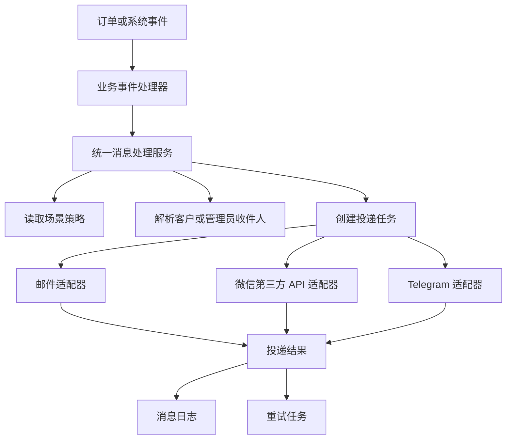

# CFFK 推送设计方案

## 1. 设计背景

CFFK 需要为订单支付、发货等业务事件提供通知能力。计划支持三个推送渠道：

- 电子邮件：可以发送给客户，也可以发送给管理员。
- 微信（三方 API）：通过第三方推送服务发送，只能发给配置的管理员接收目标。
- Telegram：通过 Bot API 发送，只能发给配置的管理员接收目标。

当前已实现电子邮件、微信三方 HTTP 接口和 Telegram Bot API 的实际投递。

本方案参考 `edgeKey` 的邮件模块，并结合 CFFK 当前的 Vike + Vue + Telefunc + Cloudflare Workers + D1/Drizzle 架构设计。CFFK 当前已经存在：

- `/push/config` 推送总配置页；
- `/push/email` 邮件统计页；
- `/push/email/post-office` 邮件服务商配置页；
- `/push/email/templates` 邮件模板页；
- `/push/history` 推送历史页；
- `server/push/service.ts` 统一推送、邮件发送和重试逻辑；
- `server/push/admin.telefunc.ts` 推送策略和推送日志查询；
- `pushChannelConfig`、`pushPolicy`、`pushLog`、`pushRetry`、`emailTemplate` 数据表。

现有实现可以作为迁移基础，但订单事件目前直接调用邮件服务。后续接入其他渠道时，必须改为由唯一的消息处理服务统一决定渠道、解析收件人、执行投递、记录结果和处理重试。

## 2. 目标与非目标

### 2.1 目标

1. 业务代码只提交一次消息，不直接依赖邮件、微信或 Telegram 的实现。
2. 一条消息可以选择多个可用渠道，渠道之间互不影响。
3. 明确区分普通消息和管理消息，防止客户消息误发到管理员专属渠道。
4. 每个渠道、每个收件人都产生独立的投递结果和日志。
5. 支持幂等、失败重试、人工重试和可观测的失败原因。
6. 当前只启用邮件时，邮件功能可以平滑迁移，不要求一次完成全部渠道。
7. 凭证保存在受保护的 Provider 配置中，后台只显示掩码，推送日志不记录连接凭证。

### 2.2 非目标

- 第一阶段不实现微信（三方 API）和 Telegram 的实际投递。
- 第一阶段不建设复杂的用户通知中心、站内信或 WebSocket 推送。
- 第一阶段不保证跨渠道的全局原子成功。渠道投递是外部副作用，允许出现部分成功。
- 不把客户的 Telegram/微信账号作为普通客户联系方式使用。当前业务约束是这两个渠道只面向管理员配置的接收目标。

## 3. 核心概念

### 3.1 消息类型

消息类型表示消息的接收范围和安全边界，不等同于渠道：

| 类型 | 含义 | 允许的接收者 | 当前可用渠道 |
| --- | --- | --- | --- |
| `NORMAL` 普通消息 | 面向客户的订单或业务通知 | 订单客户，通常来自订单联系方式 | 邮件 |
| `ADMIN` 管理消息 | 面向后台管理者的运营、支付、库存和异常通知 | 已配置的管理员邮箱或渠道接收目标 | 邮件 |

微信和 Telegram 的渠道能力必须声明为 `ADMIN` 专属。服务端也必须再次校验，不能只依赖页面禁用开关。

### 3.2 消息场景

建议统一使用场景枚举，第一阶段沿用现有订单场景：

- `TEST`：管理员发起的测试消息，只允许管理员指定的测试收件人。
- `ORDER_PAID`：订单支付成功。
- `DELIVERY_SUCCESS`：订单发货成功。
- `DELIVERY_FAILED`：订单发货失败。

后续可增加 `LOW_STOCK`、`PAYMENT_FAILED`、`SYSTEM_ERROR` 等管理场景。新增场景需要增加 TypeScript 场景定义、模板和策略配置，但不需要 SQL migration。

### 3.3 渠道与 Provider

`channel` 表示用户可见的投递渠道，`provider` 表示该渠道的具体实现：

```ts
type PushChannel = "EMAIL" | "WECHAT" | "TELEGRAM";
type PushMessageType = "NORMAL" | "ADMIN";
type PushScene = "TEST" | "ORDER_PAID" | "DELIVERY_SUCCESS" | "DELIVERY_FAILED";
```

例如：邮件下可以有 `SMTP`、`RESEND`、`BREVO`、`CLOUDFLARE`；微信（三方 API）下可以接入不同第三方推送服务；Telegram 下可以有不同 Bot API 连接配置。

本方案固定只有 `EMAIL`、`WECHAT`、`TELEGRAM` 三个顶层渠道，不设计运行时新增任意顶层渠道。扩展目标仅指：在已有顶层渠道下新增 Provider 时不迁移 SQL。现有代码中的 `WECOM` 在首次通用表迁移时统一映射为 `WECHAT`。

### 3.4 Provider 配置采用版本化 JSON

不同 Provider 的连接参数差异很大，数据库采用“固定公共列 + `configJson`”：

```text
pushChannelConfig
  id
  channel              # 固定为 EMAIL / WECHAT / TELEGRAM
  provider             # SMTP / RESEND / PUSHPLUS / TELEGRAM_BOT 等普通字符串
  name
  isEnabled
  configJson           # Provider 专属配置 JSON
  createdAt
  updatedAt
```

首期建立通用表时需要执行一次 SQL migration。完成后，在三个顶层渠道下新增 Provider 只增加服务端 Provider 定义、表单定义和发送适配器，不新增列、不新增表，也不迁移 SQL。

`configJson` 不是无约束对象：

- 包含 `schemaVersion`，便于代码升级旧配置。
- 每个 `channel + provider` 由对应 Zod schema 校验。
- Provider 定义同时提供后台表单字段，JSON 可以还原为用户可编辑的表单。
- 密码、Token 等字段返回页面时只显示掩码；未修改时保留旧值，不能把掩码保存回数据库。
- 敏感字段不得写入普通日志。是否进一步加密存储可以在安全改造阶段处理，不影响本方案的 JSON 表单结构。

SQL 迁移边界如下：

| 变更 | 是否需要 SQL migration | 原因 |
| --- | --- | --- |
| 首次建立通用 `pushChannelConfig` 等表 | 需要 | 新表和索引必须创建 |
| 邮件下新增 Resend、Brevo 等 Provider | 不需要 | 使用已有 `provider` 和 `configJson` |
| 微信（三方 API）下新增 PushPlus、Server 酱等 Provider | 不需要 | 使用已有 `provider` 和 `configJson` |
| Telegram 下新增另一种 API 连接方式 | 不需要 | 使用已有 `provider` 和 `configJson` |
| 新增 `configJson` 字段、修改字段含义 | 不需要 SQL，但需要代码 schema 版本迁移 | 通过 `schemaVersion` 兼容 |
| 新增第四个顶层渠道 | 当前不支持；若未来需要则评估 migration | 本方案固定三渠道 |

SMTP 示例：

```json
{
  "schemaVersion": 1,
  "host": "smtp.example.com",
  "port": 465,
  "secure": true,
  "username": "notice@example.com",
  "password": "<服务端保存，页面不回显原文>",
  "fromEmail": "notice@example.com",
  "fromName": "CFFK"
}
```

## 4. 总体架构



推荐的代码边界：

```text
server/push/
  types.ts                 # 消息、渠道、场景、收件人和结果类型
  service.ts               # 唯一入口：提交消息、解析策略、创建任务、汇总结果
  policy.ts                # 场景和消息类型的渠道策略
  recipient.ts             # 客户邮箱和管理员接收目标解析
  repository.ts            # pushPolicy、pushChannelConfig、pushLog、pushRetry 读写
  adapters/
    email.ts               # 邮件渠道适配器，复用现有邮件 Provider
    wechat.ts              # 微信第三方 HTTP API 适配器
    telegram.ts            # Telegram Bot API 适配器
  retry.ts                 # 统一重试调度
  admin.telefunc.ts        # 后台配置和日志查询

server/email/
  admin.telefunc.ts        # 邮件 Provider、模板和测试管理入口
  order-events.ts          # 只负责组装业务事件，不直接发送邮件
```

唯一业务入口建议为：

```ts
await pushService.dispatch({
  scene: "ORDER_PAID",
  messageType: "NORMAL",
  orderId,
  variables,
  source: "order:paid",
});
```

管理消息使用同一个入口，仅改变 `messageType` 和策略：

```ts
await pushService.dispatch({
  scene: "DELIVERY_FAILED",
  messageType: "ADMIN",
  orderId,
  variables: { ...variables, errorMessage },
  source: "order:delivery-failed",
});
```

业务层不得出现 `sendEmail`、`sendWechat` 或 `sendTelegram` 的直接调用。

## 5. 推送策略设计

### 5.1 策略维度

策略至少由以下维度组成：

```ts
type PushPolicy = {
  enabled: boolean;
  messageType: PushMessageType;
  scene: PushScene;
  channels: PushChannel[];
};
```

建议将策略按“消息类型 + 场景”配置，而不是为每个渠道复制一组布尔字段。例如：

```json
{
  "NORMAL:ORDER_PAID": ["EMAIL"],
  "NORMAL:DELIVERY_SUCCESS": ["EMAIL"],
  "NORMAL:DELIVERY_FAILED": [],
  "ADMIN:ORDER_PAID": ["EMAIL"],
  "ADMIN:DELIVERY_SUCCESS": ["EMAIL"],
  "ADMIN:DELIVERY_FAILED": ["EMAIL"]
}
```

策略由独立的 `pushPolicy` 表保存。系统不提供全局推送开关，也不要重新增加 `emailEnabled`、`wecomEnabled`、`telegramEnabled` 或场景布尔字段。

### 5.2 能力校验

服务端在生成投递任务时必须校验：

1. 当前场景策略是否启用。
2. 场景是否允许当前消息类型。
3. 渠道是否已启用且配置有效。
4. `NORMAL` 消息只能选择支持客户收件人的渠道。
5. `WECHAT`、`TELEGRAM` 只能出现在 `ADMIN` 消息中。
6. 对应 Provider 的 `configJson` 是否包含有效管理员接收目标。
7. 是否已存在相同幂等键的成功投递。

无效渠道不能静默当作成功。应写入 `SKIPPED` 或 `FAILED` 的可查询结果，并说明 `CHANNEL_NOT_AVAILABLE`、`RECIPIENT_NOT_CONFIGURED` 等原因。

## 6. 收件人模型

### 6.1 客户收件人

客户收件人来自订单快照：

- `contactType = EMAIL` 时，创建订单服务必须在写入 D1 前校验并规范化纯邮箱地址；显示名格式、空地址和无效地址直接拒绝。
- 推送任务仍会再次校验订单快照，只有格式有效时才创建邮件客户投递任务，避免旧数据或手工数据进入邮件 Provider。
- QQ、Telegram 或其他联系方式当前不能被自动转换成邮件或管理员账号。
- 推送日志直接记录完整客户邮箱，便于管理员查询和排查发送问题。

### 6.2 管理员收件人

管理消息不应只依赖当前登录管理员。建议拆成两类配置：

- 管理员邮件收件人固定取 `adminBootstrap` 对应唯一 Root 管理员的邮箱，不提供额外邮箱配置。
- 微信（三方 API）和 Telegram 的管理员接收目标直接保存在对应 Provider 的 `configJson` 中，例如第三方推送 Key、Telegram ChatId。

### 6.3 收件人快照

创建投递任务时保存完整收件人快照，不要在重试时重新读取可能已经变化的配置。这样可以保证日志准确显示“当时发送给谁”。密码、API Key 和 Bot Token 不属于收件人信息，禁止写入推送日志。

## 7. `/push/config` 页面设计

页面负责“推送策略”，不负责填写具体 Provider 的全部参数。建议保留当前页面路径，并将页面分为以下区域。

### 7.1 渠道状态

- 分别显示电子邮件、微信三方和 Telegram 的接入状态与不可用原因。
- 推送是否投递仅由各场景策略控制，不提供全局关闭开关。
- 保存按钮显示保存中、成功和失败状态。

### 7.2 普通消息

按场景列出策略，每行显示：场景、说明、可选渠道：

| 场景 | 邮件 | 微信（三方 API） | Telegram |
| --- | --- | --- | --- |
| 支付成功 | 可选 | 禁用并标注“仅管理员” | 禁用并标注“仅管理员” |
| 发货成功 | 可选 | 禁用并标注“仅管理员” | 禁用并标注“仅管理员” |
| 发货失败 | 可选 | 禁用并标注“仅管理员” | 禁用并标注“仅管理员” |

普通消息只允许勾选邮件。若客户联系方式不是邮箱，页面不需要展示额外渠道，因为服务端会跳过无法投递的任务。

### 7.3 管理消息

管理员策略单独展示同样的场景矩阵：

- 邮件：当前可用，收件人固定为唯一 Root 管理员邮箱。
- 微信（三方 API）：未接入时禁用；存在已启用且配置有效的 Provider 时可选。
- Telegram：存在已启用且配置有效的 Bot Provider 时可选。

页面应显示“渠道可用性”和“策略开关”两个不同状态。渠道未配置时，不应让用户误以为打开开关就能发送。

### 7.4 页面入口

- `/push/config`：普通消息和管理消息的策略总览。
- `/push/email`：邮件统计。
- `/push/email/post-office`：邮件 Provider 配置和测试。
- `/push/email/templates`：邮件模板。
- `/push/wecom`：微信（三方 API）Provider 配置和测试。路径暂时沿用现有目录，内部渠道值统一使用 `WECHAT`。
- `/push/telegram`：配置 Bot Token 和 Chat ID，并通过 Telegram Bot API 测试发送。
- `/push/history`：统一投递历史，支持按消息类型、场景、渠道、状态、订单号筛选。

## 8. 统一投递流程

1. 业务事件完成状态变更后，提交一个带 `scene`、`messageType`、`orderId`、变量和来源的消息请求。
2. 统一服务读取策略并展开目标渠道。
3. 统一服务解析客户或管理员收件人，生成每个“渠道 + 收件人”的投递任务。
4. 为消息和投递任务生成幂等键，并先写入任务记录。
5. 调用渠道适配器。适配器只负责格式转换、调用外部 API 和返回 Provider 结果。
6. 统一服务更新投递状态并写入成功或失败日志。
7. 可重试的失败进入重试队列；不可重试的配置错误直接标记为永久失败。
8. 一个渠道失败不能回滚订单状态，也不能阻止其他渠道继续投递。
9. 管理后台从统一日志读取结果，不再分别拼接邮件日志和渠道日志。

订单事件需要具备幂等性。推荐幂等键：

```text
{eventId}:{messageType}:{scene}:{channel}:{recipientKey}
```

如果暂时没有事件表，至少使用 `orderId + messageType + scene + channel + recipientSnapshot` 的稳定组合。该组合必须写入 `pushLog.idempotencyKey` 唯一索引，不能只在发送前查询，否则并发请求仍可能重复发送。重试复用同一条 `pushLog`，不能生成新的幂等键。

## 9. 状态和错误模型

当前规模不单独建立消息主状态。统一服务展开渠道后，每个“渠道 + 收件目标”直接生成一条 `pushLog`，该记录同时表示投递任务和最终结果。

投递状态包括：

- `PENDING`：等待首次发送或下一次重试。
- `PROCESSING`：正在发送。
- `SUCCESS`：发送成功。
- `FAILED`：不可重试的永久失败。
- `SKIPPED`：策略关闭、无收件目标或渠道不可用。
- `EXHAUSTED`：可重试错误达到最大次数后仍失败。

错误应区分：

- 配置错误：Provider 未配置、凭证无效、模板不存在，不建议自动重试。
- 收件人错误：邮箱无效、管理员接收目标未配置，不建议自动重试。
- 外部服务临时错误：超时、限流、5xx，进入指数退避重试。
- 业务重复：`idempotencyKey` 唯一键冲突时不创建新日志、不再发送，直接返回已有 `pushLog` 记录。

## 10. 数据模型建议

统一模型只需要四类数据：渠道配置、场景策略、投递日志和重试记录，不再额外建立消息主表与投递明细表。

### 10.1 `pushPolicy`

保存 `messageType`、`scene`、`channelsJson`、`isEnabled`、时间字段。唯一键为 `messageType + scene`。

### 10.2 `pushLog`

一行表示一次“渠道 + 收件目标”的投递任务和结果，保存：

- `id`、`orderId`、`idempotencyKey`、`channelConfigId`；
- `messageType`、`scene`、`channel`、`provider`；
- 完整 `recipient`、`subject`；
- `status`、`attemptCount`、`providerMessageId`、`error`；
- `source`、`createdAt`、`updatedAt`。

`idempotencyKey` 建立唯一索引，避免并发事件重复创建同一投递任务。重试按 `PENDING -> PROCESSING -> SUCCESS/EXHAUSTED` 更新同一条日志的状态和次数，不重复创建业务投递记录。

### 10.3 `pushRetry`

只保存重试调度需要的信息：`pushLogId`、`nextAttemptAt`、`status` 和不含连接凭证的 `payloadJson`。通过 `pushLog.channelConfigId` 引用渠道配置，不复制 `configJson`，避免重复保存 Token 或密码。

### 10.4 渠道配置表与 JSON 配置

使用通用的 `pushChannelConfig` 保存渠道配置。公共字段用于列表、筛选、启用和路由，Provider 专属字段全部放在 `configJson`：

```ts
// 数据库存储形态，不代表直接暴露给前端
interface PushChannelConfigRecord {
  id: number;
  channel: "EMAIL" | "WECHAT" | "TELEGRAM";
  provider: string;
  name: string;
  isEnabled: boolean;
  configJson: string;
  createdAt: Date;
  updatedAt: Date;
}
```

`configJson` 建议按 Provider 拆分类型，而不是所有渠道共享一个大而可选的接口：

```ts
interface SmtpConfigV1 {
  schemaVersion: 1;
  host: string;
  port: number;
  secure: boolean;
  username: string;
  password: string;
  fromEmail: string;
  fromName?: string;
}

interface EmailApiConfigV1 {
  schemaVersion: 1;
  apiBaseUrl: string;
  apiKey: string;
  timeoutMs: number;
  fromEmail: string;
  fromName?: string;
}
```

数据库 JSON 的职责是保存配置值，不能同时承担表单布局、权限、密钥处理和运行时校验的全部职责。建议采用下面的分工：

| 内容 | 来源 | 是否存入 `configJson` |
| --- | --- | --- |
| 用户填写的 Provider 参数 | 表单提交值 | 是，按版本化配置保存 |
| 字段标题、说明、控件类型、排序 | 服务端 Provider 定义 | 否，代码维护 |
| 密码、Token、API Key | `configJson`；接口回显为掩码，推送日志不记录 | 是 |
| 当前是否启用、配置名称 | 数据库公共列 | 否，单独列保存 |
| Provider 能力、允许的消息类型 | 服务端适配器元数据 | 否，代码维护 |

### 10.5 动态 JSON 表单协议

不建议让前端根据数据库 JSON 的字段名自行猜测表单，也不建议第一阶段直接引入可以执行任意 JSON Schema 的通用表单引擎。推荐由服务端返回“配置定义 + 脱敏值”，前端使用受限控件渲染：

```ts
interface ProviderFormDefinition {
  channel: PushChannel;
  provider: string;
  schemaVersion: number;
  title: string;
  fields: ProviderFormField[];
  capabilities: {
    messageTypes: PushMessageType[];
    supportsTest: boolean;
  };
}

type ProviderFormField = {
  key: string;
  label: string;
  type: "text" | "email" | "number" | "password" | "url" | "switch" | "select" | "textarea";
  required?: boolean;
  placeholder?: string;
  description?: string;
  options?: Array<{ label: string; value: string }>;
  secret?: boolean;
  min?: number;
  max?: number;
};
```

接口返回示例：

```json
{
  "channel": "EMAIL",
  "provider": "SMTP",
  "schemaVersion": 1,
  "title": "SMTP",
  "fields": [
    { "key": "host", "label": "SMTP 主机", "type": "text", "required": true },
    { "key": "port", "label": "端口", "type": "number", "required": true, "min": 1, "max": 65535 },
    { "key": "secure", "label": "启用 TLS", "type": "switch" },
    { "key": "username", "label": "用户名", "type": "text", "required": true },
    { "key": "password", "label": "密码", "type": "password", "required": true, "secret": true }
  ],
  "values": {
    "host": "smtp.example.com",
    "port": 465,
    "secure": true,
    "username": "notice@example.com"
  },
  "configuredSecrets": ["password"]
}
```

这里的 `fields` 是服务端定义的安全白名单，`values` 是用于回显的脱敏值。前端切换 Provider 时，应先请求对应的表单定义和默认值，再根据 `fields` 渲染表单，不应把整段 `configJson` 直接绑定到页面。

### 10.6 表单保存与还原规则

保存流程必须分为“回显”和“提交”两套规则：

1. 页面打开时，服务端根据记录的 `channel` 和 `provider` 读取 JSON。
2. 服务端用当前 `schemaVersion` 的 schema 解析 JSON，并转换成表单值。
3. 密钥字段不进入 `values`，只在 `configuredSecrets` 中返回已配置的字段名。
4. 用户未修改密钥时，请求的 `values` 不包含该字段，服务端保留 D1 旧值。
5. 用户清空密钥时在 `values` 中提交 `null`；普通空字符串由提交构造器删除。
6. 用户填写新密钥时直接在 `values` 中提交非空字符串，服务端替换旧值。
7. 服务端根据 Provider schema 校验类型、必填项、范围、URL、邮箱和互斥字段。
8. 保存成功后返回新的普通值和 `configuredSecrets`，前端据此刷新表单。

建议提交格式如下：

```ts
interface SaveProviderConfigInput {
  id?: number;
  channel: PushChannel;
  provider: string;
  name?: string;
  isEnabled: boolean;
  values: Record<string, string | number | boolean | string[] | null>;
}
```

Provider 解析器负责把表单协议转换为运行时配置：

```ts
interface PushProviderDefinition<TConfig> {
  channel: PushChannel;
  provider: string;
  getFormDefinition(): ProviderFormDefinition;
  parseStoredConfig(json: string): TConfig;
  saveFormValues(input: SaveProviderConfigInput, current: TConfig | null): Promise<TConfig>;
  send(config: TConfig, message: RenderedPushMessage, recipient: PushRecipient): Promise<PushSendResult>;
}
```

这样同一份配置既可以从 JSON 还原为表单，也可以从表单安全地转换回 JSON；数据库结构不需要理解 SMTP、API 或 Telegram 的具体字段。

### 10.7 Schema 版本升级

当 Provider 配置格式变化时，不直接覆盖旧 JSON：

- 读取时根据 `schemaVersion` 选择解析器。
- 保存时迁移到当前版本。
- 迁移函数必须是显式的，例如 `migrateSmtpConfigV1ToV2`。
- 未知版本标记为配置不可用，并在后台提示升级，而不是尝试猜测字段。
- 只有配置结构变化才需要代码迁移；增加一个 Provider 不需要数据库迁移。

因此，JSON 方案减少的是数据库 schema migration，不是取消配置 schema、校验和版本迁移。Provider 定义和适配器代码仍然需要发布。

### 10.8 与现有表的关系

- 统一模型通过 SQL migration 将历史 `emailProvider` 数据迁移至 `pushChannelConfig`，并重建 `pushLog.channelConfigId` 外键。
- `pushChannelConfig.channel` 可以继续使用 Drizzle 的三值 TypeScript enum，因为顶层渠道固定；`provider` 必须是普通 `text`，不能建立限定 Provider 名称的数据库约束。
- 不建立 `provider` 单列唯一索引，允许保存多个 Provider 配置；但每个顶层渠道同一时间只允许一个 `isEnabled = true` 的配置，由服务层在启用时先关闭该渠道的其他配置。D1/SQLite 不方便通过普通唯一索引约束条件唯一，因此必须使用事务更新并在读取时检查重复启用。
- `pushPolicy.channelsJson` 保存固定三个顶层渠道的选择，新增 Provider 不影响策略表。
- `pushLog` 和 `pushRetry` 使用通用字段及必要 JSON 快照，不为具体 Provider 增加字段。
- `emailTemplate` 第一阶段继续作为邮件模板来源；微信和 Telegram 的消息格式可先由适配器生成，确有模板编辑需求时再扩展。
- `pushLog` 和 `pushRetry` 是唯一投递日志与重试表。
- 不使用全局推送开关，场景启停和渠道选择统一由 `pushPolicy` 保存。

## 11. 邮件第一阶段实施方案

### 阶段 1：整理现有能力

1. 在 `server/push/types.ts` 建立消息类型、场景、渠道、状态和结果类型。
2. 统一服务负责策略判断、日志写入、邮件 Provider 适配和重试调度。
3. 保留现有邮件 Provider、模板和测试页面，但全部调用统一推送服务。
4. 订单事件调用统一 `dispatchPush`，不直接依赖邮件发送实现。
5. 历史、统计和重试统一读取 `pushLog` / `pushRetry`。

### 阶段 2：完成配置页

1. `/push/config` 改为普通消息和管理消息两组策略矩阵。
2. 服务端根据已配置 Provider 返回渠道能力状态。
3. 微信和 Telegram 的开关保持禁用，不产生假成功日志。
4. 管理员邮箱固定使用 `adminBootstrap` 对应唯一 Root 管理员的 Better Auth 邮箱。

### 阶段 3：补齐可靠性

1. 增加事件幂等键和投递唯一索引。
2. 统一失败分类、指数退避和最大重试次数。
3. 推送历史支持分页、状态、渠道、类型、场景、订单号和时间范围筛选。
4. 测试邮件必须明确标记为 `TEST`，且不受业务消息开关影响。
5. 日志完整记录收件人和发送结果，但禁止记录 API Key、SMTP 密码和 Bot Token 等连接凭证。

## 12. 微信（三方 API）和 Telegram 后续接入

### 12.1 微信（三方 API）

微信作为固定顶层渠道，下面可以增加 PushPlus、Server 酱或其他第三方 API Provider。每个 Provider 只需要提供：

- 唯一 Provider 标识；
- `configJson` 的 Zod schema；
- 后台表单字段定义；
- API 发送适配器；
- 配置有效性和测试发送逻辑。

第三方 API 的 Token、Topic、接收标识等都保存在该 Provider 的 `configJson` 中。新增一种第三方 API 不增加数据库字段，不执行 SQL migration。

### 12.2 Telegram

Telegram 使用 Bot API。`configJson` 保存 Bot Token、ChatId 等连接参数，后台通过同一套动态表单协议配置和脱敏回显。新增 Telegram 下的其他连接方式时同样只增加 Provider 定义和适配器，不执行 SQL migration。

## 13. 安全、隐私和运维要求

- 所有配置保存接口必须经过 `requireAdmin`，不能只依赖后台页面隐藏按钮。
- 渠道能力校验必须在服务端执行，防止构造请求绕过“仅管理员”限制。
- 推送日志中的邮箱、ChatId、接收标识和错误信息按原值记录，便于排查；但 API Key、SMTP 密码和 Bot Token 等连接凭证禁止写入日志。
- 模板变量使用白名单渲染，禁止把变量值当作模板代码执行。
- 邮件或第三方渠道发送失败不能改变支付、发货和订单状态。
- 所有发送入口记录 `source`/`triggeredBy`，区分业务事件、管理员测试和定时重试。
- 对外部 API 设置超时、限流和最大响应体大小，避免 Worker 长时间占用；邮件 API 的成功响应允许为空或非 JSON，不能因为第三方返回 `202/204` 空 body 将已发送邮件误记为失败。
- 重试任务必须可被并发 Worker 领取，使用条件更新或租约避免重复发送。
- 生产环境需要监控发送成功率、失败率、重试积压、永久失败数量和各渠道延迟。

## 14. 需要提前确认的问题

1. “普通消息”是否只包含客户订单通知，还是也包括所有非异常系统消息？建议第一阶段限定为客户订单消息。
2. 管理员开启多个渠道时，是所有渠道并行发送，还是按优先级失败转移？本方案建议并行发送，日志分别记录，避免一个渠道故障影响其他渠道。
3. 微信（三方 API）首期接入哪个 Provider，以及该 Provider 所需的 Token 和接收标识格式。
4. 是否需要管理员手动重试单条失败记录？建议提供，并更新同一条 `pushLog` 的尝试次数和结果。
5. 统一模型是否需要保留旧邮件表？不需要；新项目直接使用 `pushLog` / `pushRetry`，旧表和兼容代码应删除。

## 15. 验收标准

### 功能验收

- 配置页能分别配置普通消息和管理消息。
- 普通消息不能选择微信和 Telegram。
- 未配置或配置无效的渠道不会被标记为成功。
- 一个场景可以同时选择多个可用渠道。
- 邮件实际发送成功和失败都能在统一历史中查询。
- 邮件失败会按策略重试，重复事件不会重复发送成功通知。
- 测试消息不会改变业务消息的发送状态。

### 安全验收

- 未登录用户和非管理员不能读取或修改推送配置、模板和日志。
- API Key、密码、Bot Token 原文不出现在页面响应、推送日志或错误提示中。
- 邮件配置的管理读取、启用和实际发送使用同一 strict parser，并核对数据库 `provider` 与 `configJson.kind`；未知字段或类型不匹配的配置不能发送。
- 损坏配置不能测试或重新启用，但必须允许直接停用；合法 JSON 中仍可识别的 Secret 只返回 `configuredSecrets`，便于修复时保留。
- 构造请求无法将客户消息路由到微信或 Telegram。
- 客户收件人和管理员收件人不会被错误混用。

### 运维验收

- 日志可按渠道、消息类型、场景、状态和时间分页查询。
- 失败原因可以区分永久失败和可重试失败。
- 重试任务不会被并发执行两次。
- 推送失败不会影响订单状态变更和支付回调响应。

## 16. 结论

“由唯一消息处理服务负责投送和记录”是正确方向，但需要把职责进一步拆开：业务模块只产生消息意图，统一服务负责策略和收件人，渠道适配器负责外部 API，日志层负责消息与每个投递目标的结果，重试层负责暂时性失败。

最重要的模型约束是：消息类型决定接收范围，渠道声明自身能力，服务端负责最终校验。这样既能满足“邮件可发客户和唯一管理员、微信/TG只发管理员配置目标”的要求，也能保证在三个固定顶层渠道下新增 Provider 时不修改数据库结构。
