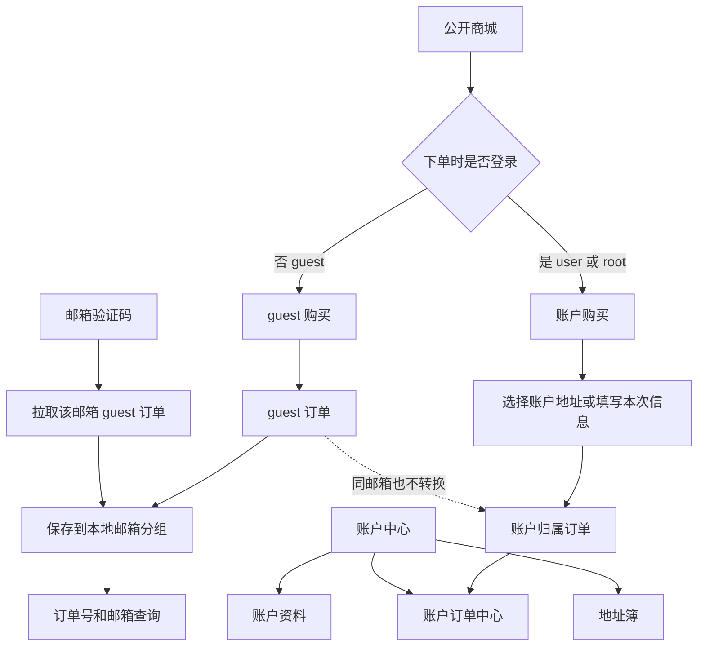
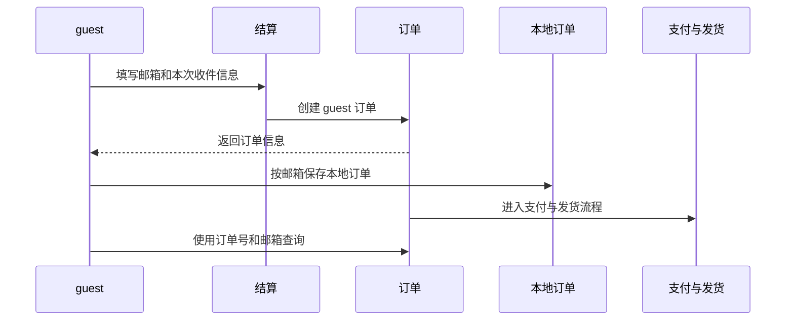
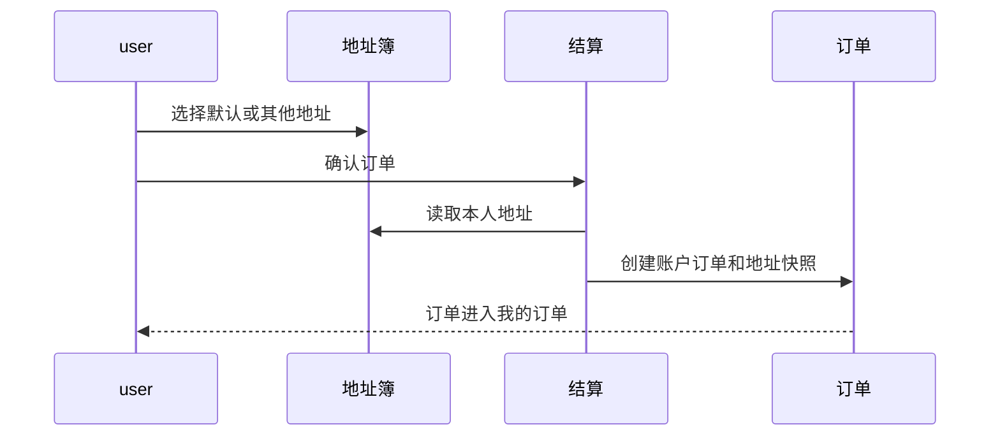
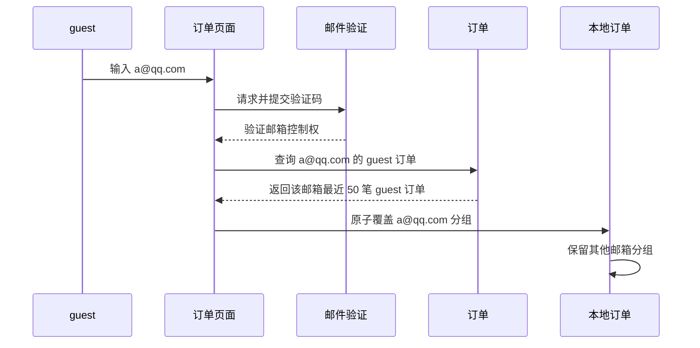

# CFFK 用户账户与订单设计方案

> **文档状态：设计中**
>
> 本方案定义顾客注册、登录、地址簿和账户订单的整体框架。CFFK 是尚未上线的新项目，不为旧用户或旧订单设计兼容流程，也不扩展为多角色、会员等级或复杂权限系统。

## 1. 设计背景

CFFK 当前以 `guest` 购买为主：未登录顾客填写联系方式完成下单，订单记录保存在当前浏览器的本地存储中，之后通过本机订单入口查看。

这种模式适合快速购买，但存在明显限制：

- 更换设备或清理浏览器数据后，不容易找回订单；
- 重复购买时需要反复填写联系信息和收件地址；
- 已注册顾客无法集中查看归属于账户的历史订单；
- 实物商品缺少可复用的地址簿；
- guest 订单与注册账户订单缺少明确、稳定的归属边界。

项目已经具备统一身份系统，并明确只有 `guest`、`user`、`root` 三种身份。本次设计在现有身份模型上增加顾客能力，不另建一套会员系统。

## 2. 设计目标与非目标

### 2.1 目标

1. 顾客可以注册、登录和退出账户。
2. 登录顾客可以维护自己的常用收货地址。
3. 登录顾客下单后，订单自动归属当前账户。
4. 登录顾客可以跨设备查看登录状态下创建的账户订单和发货结果。
5. `guest` 仍可直接购买，不强制注册。
6. guest 订单保存在本地，并可通过订单号和下单邮箱查询。
7. guest 可通过邮箱验证码恢复该邮箱下最近 50 笔 guest 订单到当前设备，超出时明确提示联系管理员。
8. guest 订单与同邮箱注册账户的订单始终分开归属和统计。
9. 历史订单保存下单时的信息快照，不受账户资料或地址后续修改影响。
10. 顾客身份与唯一 root 管理员身份保持清晰边界。

### 2.2 非目标

本阶段不建设：

- 会员等级、积分、余额、成长值或储值体系；
- 多角色 RBAC、权限点或多管理员系统；
- 用户分组、标签、画像、营销自动化或 CRM；
- 多人共享地址或家庭账户；
- 第三方社交账号登录；
- 站内信、好友、评论或社区能力；
- 复杂的账户合并、组织账户或企业采购流程；
- 将 guest 历史订单转换或自动归入注册账户；
- 将 guest 订单计入账户积分、等级或累计消费。

## 3. 核心设计结论

CFFK 用户与订单体系采用以下固定原则：

1. **共用一个身份体系。** 顾客和 root 都是已登录用户，root 只是其中唯一拥有后台权限的账户。
2. **不强制登录购买。** 注册登录是便利能力，不是下单门槛。
3. **订单归属由下单时的身份决定。** guest 创建 guest 订单；`user` 或 `root` 登录后创建账户订单。
4. **两类订单永久分离。** 后续使用同一邮箱注册、登录或修改账户邮箱，都不改变既有 guest 订单归属。
5. **guest 订单保存在本地。** 本地按下单邮箱组织订单，并通过订单号和对应邮箱读取订单详情。
6. **邮箱验证码只恢复 guest 订单。** 验证成功后，以服务端最近 50 笔结果覆盖本地同邮箱分组，其他邮箱分组保持不变。
7. **账户订单只通过登录查看。** 账户订单不写入 guest 本地订单，也不能通过邮箱验证码拉取。
8. **登录后分区展示两类订单。** “我的订单”展示账户订单，“匿名订单”展示当前浏览器中的 guest 订单，两者不合并归属或统计。
9. **地址簿只属于账户。** guest 可填写本次收件信息，但不能保存长期地址。
10. **订单保存信息快照。** 地址、联系方式和商品信息在下单时固化，后续修改账户或地址不改变历史订单。
11. **root 初始化与顾客注册彻底分离。** `/setup` 是受控的管理员初始化入口，`/signup` 只能注册普通顾客。

## 4. 身份与权限模型

项目继续只保留三种身份：

| 身份 | 含义 | 主要能力 |
| --- | --- | --- |
| `guest` | 未登录顾客 | 浏览商品、guest 下单、本地订单、订单号与邮箱查询、邮箱验证码恢复 |
| `user` | 已登录顾客 | 浏览商品、账户下单、地址簿、账户订单、账户资料 |
| `root` | 唯一管理员 | user 全部能力、后台管理能力 |

### 4.1 顾客与 root 的关系

顾客和 root 使用同一个账户与会话体系，但授权来源不同：

- 登录成功只代表成为 `user`；
- 只有被系统明确指定的唯一账户是 `root`；
- 普通顾客注册永远不能自动获得后台权限；
- root 在公开商城购买商品时，订单仍按普通账户规则归属；
- root 的后台权限不能用于绕过顾客订单的本人资源边界。

### 4.2 Root 初始化边界

当前开发期“首个注册用户成为 root”的方式必须删除，不能继续用于开放顾客注册后的模型。

Root 只能通过管理员专用的 `/setup` 完成首次初始化，顾客只能通过 `/signup` 注册。两条流程必须满足：

- `/setup` 仅在系统尚无 root 且请求通过独立的部署初始化授权时可用，不能采用“谁先访问谁成为 root”；
- root 创建成功后立即永久关闭 `/setup` 的注册能力，后续访问统一返回 404；
- `/signup` 在 root 尚未初始化时不可注册，只显示“网站还未初始化，请稍后再试...”且不暴露初始化方式；
- `/signup` 在初始化完成后创建的账户一律是普通 `user`，不参与 root 选举；
- 系统始终只保留一个 root；
- 不提供顾客侧或普通后台页面修改 root 的能力；
- `/setup` 不得返回或展示 `ADMIN_PATH`，root 初始化成功后的后台地址仍由站长通过部署配置掌握。

## 5. 总体业务架构



系统划分为五个协作领域：

| 领域 | 职责 |
| --- | --- |
| 身份 | 注册、登录、退出、会话和账户安全 |
| 账户 | 顾客基本资料与账户状态 |
| 地址 | 顾客本人地址的新增、编辑、默认和删除 |
| 订单 | guest 订单、账户订单、订单归属和订单查询 |
| 结算 | 根据当前身份组织联系方式、地址和订单创建 |

领域之间通过明确边界协作：

- 身份领域只回答“当前是谁”，不直接管理订单和地址；
- 地址领域只管理可复用地址，不承担历史订单履约信息；
- 结算领域读取当前身份和选中地址，创建订单快照；
- 订单领域根据下单时身份固定订单类型，并决定 guest 查询或账户访问边界；
- 后台订单管理仍是 root 能力，与顾客订单中心分开。

## 6. 注册与登录体验

### 6.1 注册

顾客使用昵称、邮箱和密码创建账户。注册完成后的目标是建立稳定身份，不在注册流程中加入地址、付款资料或营销偏好，避免流程过长。

注册流程应满足：

- 明确说明账户用于跨设备查看**登录状态下创建的账户订单**和保存地址，不暗示历史 guest 订单会自动归入账户；
- 不要求注册后才能浏览或购买；
- 不向外暴露邮箱是否已注册等敏感状态；
- 具备防自动化注册和暴力尝试能力；
- 正式上线时具备邮箱验证与密码找回能力；
- 注册成功后回到进入注册前的合理业务位置。

### 6.2 登录

顾客使用邮箱和密码登录。公开商城只提供普通顾客登录入口：

- `user` 或 `root` 从公开入口登录后，都进入原页面或公开账户中心；
- 公开商城始终把 root 表现为普通已登录顾客，不展示管理员身份、后台入口或后台路径；
- root 只有在已经掌握 `ADMIN_PATH` 并主动访问该地址时，才进入后台登录或管理流程；
- 顾客入口与后台入口共用会话，但不共用页面入口和操作语义。

### 6.3 账户安全

首期账户安全范围包括：

- 邮箱验证；
- 忘记密码与重置密码；
- 修改密码后使其他会话失效；
- 登录、注册和找回流程的频率限制与人机验证；
- 统一、脱敏的失败提示。

双重认证继续作为 root 的管理安全能力，不要求普通顾客启用。

## 7. 账户中心信息架构

公开商城增加统一账户入口，建议采用以下正式页面结构：

| 页面 | 职责 |
| --- | --- |
| 顾客登录 | 登录现有账户 |
| 顾客注册 | 创建账户 |
| 找回密码 | 发起密码重置 |
| 账户资料 | 查看和修改本人基本资料 |
| 地址簿 | 管理常用收货地址 |
| 订单页面 | 分区展示“我的订单”和“匿名订单”，并提供 guest 邮箱恢复 |

订单页面继续使用当前唯一正式入口，不另建平行路径。页面将两类订单分开呈现，不能合并成同一列表：

### 匿名订单

- guest 和已登录顾客都可以看到当前浏览器保存的 guest 订单；
- 本地订单按标准化后的下单邮箱分组；
- 支持通过订单号和对应下单邮箱查看单笔订单；
- 支持通过邮箱验证码恢复该邮箱最近 50 笔 guest 订单；
- 邮箱恢复只覆盖本地同邮箱分组，其他邮箱分组不受影响；
- 提供“删除该邮箱的浏览器缓存订单数据”和“删除全部浏览器缓存订单数据”；
- 页面明确说明匿名订单不属于当前账户，不参与账户积分、等级或累计消费。

### 我的订单

- guest 状态提示登录后查看账户订单，不显示任何账户订单数据；
- user / root 状态只展示当前账户名下的账户订单；
- 支持查看订单详情和继续支付；
- 不提供 guest 订单转换、认领或自动归属能力；
- 退出登录后不在本地保留账户订单列表。

登录只改变“我的订单”区域的可用状态，不隐藏或迁移“匿名订单”区域中的本地数据。

## 8. 地址簿设计

### 8.1 地址的业务边界

地址是顾客可复用的个人资料，只服务于未来下单，不代表历史订单的实际收件信息。

每条地址包含：

- 收件人；
- 联系电话；
- 国家或地区；
- 省、市、区；
- 详细地址；
- 邮政编码（可选）；
- 默认地址状态。

首期以中国大陆地址体验为主，同时保留国家或地区概念，避免地址含义与行政区字段绑定得过死。

### 8.2 地址规则

- 地址只能由本人查看和管理；
- 每个账户可保存有限数量的地址，避免无限增长；
- 第一个地址自动成为默认地址；
- 同一账户同一时间只有一个默认地址；
- 删除默认地址后，系统自动选取另一条地址作为默认地址；
- 删除地址不影响已经创建的订单；
- 地址页面不展示其他用户存在与否的信息；
- root 也不能通过顾客地址能力查看其他顾客地址。

### 8.3 结算中的地址选择

对于需要收件地址的商品：

- 登录顾客优先选择地址簿中的地址；
- 默认地址自动预选，但顾客可以更换；
- 顾客可以在结算过程中快速添加新地址；
- guest 填写本次收件地址；
- 系统在创建订单时保存一份独立的地址快照；
- 订单创建后修改或删除地址簿记录，不影响该订单。

不需要地址的数字商品不展示地址选择，避免给发卡购买增加无关步骤。

## 9. 订单归属模型

### 9.1 Guest 订单

`guest` 是未登录顾客，guest 状态下创建的订单没有账户归属。guest 订单使用两种查看方式：

1. 当前设备本地保存的订单入口；
2. 通过邮箱验证码恢复该邮箱下最近 50 笔 guest 订单。

单笔 guest 订单通过订单号和下单邮箱查询。订单号必须不可枚举，邮箱作为第二项匹配条件；查询失败时不区分订单号错误、邮箱错误或订单不存在。

Guest 订单支持：

- 下单成功后保存到当前设备；
- 查看支付和发货状态；
- 对待支付订单继续支付；
- 通过邮箱验证码跨设备恢复；
- 按下单邮箱组织本地订单。

Guest 订单不支持：

- 登录后自动出现在账户订单中；
- 归入或转换为账户订单；
- 计入任何账户的累计消费、积分、会员等级或其他账户权益。

### 9.2 账户订单

`user` 或 `root` 登录状态下创建的订单自动归属当前账户。顾客进入“我的订单”后，通过登录会话查看本人订单。

账户订单能力包括：

- 按时间查看订单列表；
- 查看订单状态、金额、商品和创建时间；
- 查看订单详情和发货内容；
- 对待支付订单继续支付；
- 查看下单时的联系方式和收件快照。

账户订单不保存到本地 guest 订单列表，也不能通过订单号和邮箱或邮箱验证码匿名读取。账户身份只能访问本人订单。root 的全量订单查看必须继续通过后台订单管理完成，不能混入顾客订单中心。

### 9.3 同邮箱订单的归属隔离

邮箱在不同场景中的含义不同：

| 场景 | 邮箱含义 |
| --- | --- |
| guest 订单 | 联系方式、单笔查询条件和跨设备恢复依据 |
| 账户订单 | 本次订单的联系信息，不决定账户归属 |
| 用户账户 | 登录身份标识 |

订单归属只由创建订单时的登录状态决定，邮箱相同不代表订单属于同一账户。

例如，`123@qq.com` 先以 guest 身份创建 10 笔订单，之后使用同一邮箱注册账户并登录创建 5 笔订单：

- 前 10 笔始终是 guest 订单，只能通过本地入口或邮箱验证码恢复；
- 后 5 笔是账户订单，只能登录该账户查看；
- 注册、登录、验证邮箱或修改账户邮箱都不会改变前 10 笔订单归属；
- 未来账户积分、等级和累计消费只统计后 5 笔账户订单；
- 全站销售额、商品销量和全站订单量可同时统计两类有效订单。

### 9.4 订单快照

订单是交易事实，必须保存下单时的业务快照，包括：

- 商品名称和价格；
- 购买数量和优惠结果；
- 联系方式；
- 收件地址；
- 配送或发货方式；
- 支付渠道；
- 其他影响履约的必要信息。

账户资料、地址簿、商品或支付配置后续变化，不得改变历史订单展示和履约依据。

## 10. Guest 本地订单与邮箱恢复

### 10.1 本地订单

Guest 下单成功后，当前设备在本地保存该订单的查询信息和必要摘要。登录状态下创建的账户订单不写入本地。

本地订单按标准化后的下单邮箱分组。邮箱在 guest 结算、写入本地、单笔查询和邮箱恢复四个环节必须使用同一标准化规则：去除首尾空白并统一大小写后再比较和分组。每个邮箱分组最多保留最近 50 笔 guest 订单，多个邮箱分组可以同时存在于同一设备。

本地数据只保存订单入口所需的订单索引和必要摘要。订单的实时支付状态、发货状态和发货内容仍以服务端结果为准；完整卡密、完整地址、支付信息、验证码和其他敏感详情不得作为长期本地缓存。

顾客可以主动删除某一邮箱分组或全部 guest 订单的**浏览器缓存订单数据**。该操作只清理当前浏览器中的入口，不删除服务端订单；后续仍可通过订单号和邮箱查询，或再次完成邮箱验证恢复。

### 10.2 邮箱验证码恢复

Guest 可以输入下单邮箱并完成验证码校验。验证成功后，系统按创建时间倒序查询该邮箱最近 50 笔 guest 订单，并更新当前设备的本地订单。

更新规则固定为：

- **同邮箱整体覆盖：** 服务端返回的最近 50 笔结果替换本地该邮箱分组，不做逐笔合并；
- **其他邮箱保持不变：** 验证 `a@qq.com` 只更新 `a@qq.com` 分组，`b@qq.com` 等其他分组不受影响；
- **空结果同样覆盖：** 如果该邮箱没有 guest 订单，则清空本地该邮箱分组；
- **数量超限明确提示：** 如果该邮箱超过 50 笔 guest 订单，页面提示“该邮箱订单较多，仅提供最近 50 笔订单数据，如需帮助请联系管理员”；
- **只返回 guest 订单：** 即使相同邮箱已经注册账户，账户订单也不能通过该流程返回；
- **只保存索引与摘要：** 恢复结果不把完整卡密、完整地址、支付信息或验证码写入本地；
- **原子替换：** 只有新分组完整写入成功后才视为覆盖完成；若浏览器存储空间不足、被禁用或写入失败，保留原分组并提示恢复结果未能保存，不能先删除旧分组；
- **服务端结果为准：** 本地摘要与服务端不一致时，以本次恢复结果更新。

```mermaid
flowchart TD
    A[本地 guest 订单] --> B[a@qq.com 分组]
    A --> C[b@qq.com 分组]
    A --> D[c@qq.com 分组]

    E[验证 a@qq.com] --> F[查询 a@qq.com 的 guest 订单]
    F --> B
    C --> G[保持不变]
    D --> H[保持不变]
```

### 10.3 邮箱恢复边界

邮箱验证码代表当前操作者在本次验证中控制该邮箱，因此可以恢复该邮箱作为联系方式的 guest 订单，但不能代替账户登录。

该流程必须满足：

- 请求验证码时不暴露该邮箱是否存在订单；
- 验证结果只包含 guest 订单；
- 验证码短时有效且限制发送和尝试频率；
- 页面明确提示恢复操作只更新本地同邮箱订单，且每次最多恢复最近 50 笔；
- 邮箱无法使用时，不通过订单号、金额等弱信息开放自助恢复；
- guest 订单不会因为邮箱验证而变成账户订单。

## 11. 公开商城导航

导航根据登录状态变化：

### 未登录

- 我的订单；
- 登录；
- 注册；
- 联系支持（配置后显示）。

### 已登录

- 我的订单；
- 地址簿；
- 账户菜单；
- 联系支持（配置后显示）。

账户菜单提供账户资料和退出登录。公开商城不得展示后台入口、`ADMIN_PATH`、root 身份标记或任何可推断后台地址的信息；即使当前登录账户是 root，公开页面的表现也必须与普通 user 一致。

## 12. 隐私与安全边界

顾客账户、地址和订单包含个人信息，必须遵循以下框架规则：

1. 页面和业务接口只返回当前功能需要的数据。
2. 地址、联系电话、邮箱、订单查询信息和发货内容不得出现在公开列表或错误提示中。
3. 账户资源的访问必须同时验证登录身份和资源归属。
4. Guest 单笔订单查询必须同时匹配不可枚举的订单号和下单邮箱，并进行合理频率限制。
5. 邮箱验证码只能恢复 guest 订单，不能作为账户订单的替代登录方式。
6. 不能通过连续编号、邮箱验证提示或查询错误推断其他顾客信息。
7. 订单号与邮箱组合、邮箱验证码不能被保存到普通业务日志或页面埋点。
8. 未预期异常进入 Workers Observability 时，应避免主动附加完整密码、会话 Cookie、邮箱验证码和完整地址。
9. `/setup` 和公开认证页面不得返回、跳转到或暗示 `ADMIN_PATH`；公开页面也不得展示 root 身份。

## 13. 与现有模块的关系

### 13.1 支付

用户体系不改变支付状态机和支付回调边界。支付模块只需要知道订单已经创建以及当前订单归属，不负责认证顾客或管理地址。

### 13.2 发货

发货始终使用订单快照，不实时读取地址簿。自动发卡、固定内容、人工发货和快递发货继续遵循现有订单发货类型。

### 13.3 推送

订单通知优先使用订单中保存的联系方式，而不是实时读取账户资料。这样可以保证通知目标与顾客下单时确认的信息一致。

未来可以允许顾客在账户中设置默认联系邮箱，但变更只影响后续订单，不追溯修改历史订单，也不改变 guest 订单与账户订单的归属。

### 13.4 后台订单管理

后台订单管理继续面向唯一 root，查看全站订单。顾客订单中心只面向本人资源，两者不能共用“root 自动放行”的查询规则。

第一阶段不新增用户管理后台。项目仍然不提供普通用户列表、封禁、角色编辑或代登录功能。

### 13.5 未来积分与账户权益

未来积分、会员等级、累计消费或用户优惠资格只能基于账户订单计算。Guest 订单仍可计入全站销售额、商品销量和全站订单量，但不能因为联系邮箱与账户邮箱相同而计入账户权益。

## 14. 关键业务流程

### 14.1 Guest 购买



### 14.2 登录购买



### 14.3 Guest 邮箱恢复



## 15. 开发计划与进度

> **维护规则：**
>
> - `[ ]` 表示未开始，`[-]` 表示进行中，`[x]` 表示已完成；
> - 阶段状态按该阶段任务的实际进度维护；
> - 任务只有在实现、相关测试和必要文档同步完成后才能标记为 `[x]`；
> - 完成任务时在任务末尾记录完成日期；存在重要取舍或阻塞时同时补充简短说明；
> - 需求发生变化时，先更新本设计方案和验收标准，再调整实现；
> - 各阶段完成后应运行相关测试、类型检查、Lint 和构建，最终结果统一记录在阶段验证中。

### 第一阶段：Guest 订单访问与归属基础

**阶段状态：** 已完成

在开放顾客注册前先完成：

- [x] 删除原有订单查询 Token（2026-08-13；运行时 DTO、数据库字段、支付回跳和邮件链接均已移除，迁移见 `0002_remove-order-query-token.sql`）
- [x] Guest 单笔订单改为订单号和下单邮箱查询（2026-08-13；SQL 同时约束 `ownerUserId IS NULL`、邮箱联系方式和标准化邮箱）
- [x] 确保订单号不可枚举，并限制查询频率（2026-08-13；订单号使用 Web Crypto 128 位随机值；单笔查询/继续支付使用 D1 原子固定窗口，Guest 每分钟 10/3 次、账户每分钟 60/10 次，限流键仅保存动作与可信请求身份的 SHA-256 摘要；Guest 批量恢复另有 OTP 防滥用限制）
- [x] 本地 guest 订单按邮箱分组（2026-08-13；每个标准化邮箱最多保留最近 50 笔非敏感摘要）
- [x] 建立 guest 订单与账户订单两种固定归属（2026-08-13；`ownerUserId = NULL` 为 Guest，非空为下单时会话用户，永不按邮箱认领）
- [x] 登录状态下创建的账户订单不写入本地（2026-08-13；客户端仅在无会话时调用 `saveGuestOrder`）
- [x] 删除“首个公开注册用户成为 root”的逻辑（2026-08-13；公开注册不再参与 Root 选举，初始化前返回通用不可用响应）
- [x] 建立一次性 `/setup`，初始化完成后返回 404（2026-08-13；无需部署密钥，首个 root 由单例绑定确定，竞争失败账号会清理）
- [x] root 未初始化时关闭 `/signup`，只显示“网站还未初始化，请稍后再试...” （2026-08-13；服务端和公开注册 API 双重限制，不暴露初始化入口）

**阶段验证：** 已完成；2026-08-13 全量 `bun test tests` 129 项通过，`bun run db:check`、定向 ESLint、相关 TS diagnostics 和 `bun run build` 通过；单笔查询限流覆盖真实 SQLite UPSERT、窗口重置、动作隔离、Guest/账户阈值与脱敏摘要键；运行时源码扫描无 `queryToken` 残留。

### 第二阶段：Guest 邮箱恢复

**阶段状态：** 已完成

在邮件投递能力稳定后完成：

- [x] 提供 guest 订单邮箱验证码（2026-08-13；6 位 Web Crypto 随机码，仅保存绑定 purpose、challenge 和部署 Secret 的 SHA-256 摘要）
- [x] 拉取已验证邮箱下最近 50 笔 guest 订单，超限时显示固定提示（2026-08-13；查询 51 条并返回 `truncated`）
- [x] 以服务端结果原子覆盖本地同邮箱分组，写入失败时保留旧分组（2026-08-13）
- [x] 保留其他邮箱的本地分组（2026-08-13）
- [x] 提供删除单个邮箱分组或全部浏览器缓存订单数据的能力（2026-08-13；均使用 Dialog 二次确认）
- [x] 严格排除账户订单（2026-08-13；恢复 SQL 强制 `ownerUserId IS NULL`）
- [x] 完成验证码发送和尝试的防滥用措施（2026-08-13；10 分钟有效、单次消费、60 秒重发限制、每小时最多 5 次、最多 5 次验证）

**阶段验证：** 已完成；2026-08-13 OTP、邮箱标准化和本地原子存储测试通过，并随全量 125 项测试及生产构建验证。

### 第三阶段：顾客认证与账户订单

**阶段状态：** 已完成

- [x] 提供注册、登录、退出（2026-08-13；公开导航已接入，Root 在公开商城与普通用户表现一致）
- [x] 提供账户邮箱验证、忘记密码和重置密码（2026-08-13；Better Auth 验证/重置回调接入现有邮件 Provider 和独立模板，重置后撤销其他会话）
- [x] 调整公开商城导航（2026-08-13；未登录显示登录/注册，已登录显示普通账户/订单/退出，不输出后台入口）
- [x] 订单页面分开展示“匿名订单”和“我的订单”，登录后仍可查看当前浏览器匿名订单（2026-08-13）
- [x] 登录顾客查看本人账户订单列表和详情（2026-08-13；列表和详情 SQL 均按当前 `ownerUserId`）
- [x] 支持账户订单继续支付（2026-08-13；继续支付复用同一 owner SQL 边界）
- [x] 确认同邮箱 guest 订单不自动归属账户（2026-08-13；无认领或 owner 更新路径）

**阶段验证：** 已完成；2026-08-13 全量 125 项测试、相关 diagnostics、定向 ESLint 和生产构建通过。

### 第四阶段：地址簿与结算

**阶段状态：** 已完成

- [x] 提供地址新增、编辑、默认和删除（2026-08-13；本人 SQL 边界、最多 10 条、首条默认和删除默认后自动顺延）
- [x] 登录顾客结算时选择地址（2026-08-13；默认地址自动预选，也可本次填写）
- [x] guest 继续填写本次地址（2026-08-13；结构化字段和前后端校验）
- [x] 订单使用独立地址快照履约（2026-08-13；保存 version 1 JSON，不受地址簿后续修改或删除影响）

**阶段验证：** 已完成；2026-08-13 地址校验、邮箱归一化和快照结构测试通过，后台详情可读取结构化快照，并随全量测试和构建验证。

### 第五阶段：上线前完善

**阶段状态：** 进行中

- [ ] 明确账户删除和个人数据处理规则
- [ ] 完成隐私政策与用户协议
- [ ] 验证邮件投递、密码找回和人机验证
- [x] 验证 guest / user / root 的全部权限边界（2026-08-13；枚举验证全部后台 Telefunc 均经 `requireAdmin()`，账户地址和订单按当前用户约束，Guest 查询/继续支付/邮箱恢复同时约束 Guest 归属与标准化下单邮箱）
- [x] 验证多邮箱本地分组、最近 50 笔限制、原子覆盖、缓存清理、账户订单隔离和地址快照流程（2026-08-13；行为测试覆盖邮箱归一化分组、单组 50 笔、单次写入覆盖及失败保留旧值、单组/全部清理；安全验收覆盖账户订单 owner 边界和本人地址 version 1 快照）
- [x] 验证所有公开页面均不泄露后台入口、`ADMIN_PATH` 或 root 身份（2026-08-13；移除全局 `passToClient` 中的 `isAdmin`，枚举扫描公开页面和商城组件，并验证公开导航将所有登录身份统一表现为普通顾客）

**阶段验证：** 部分完成；2026-08-13 后三项已通过全量 `bun test tests` 136 项、定向 ESLint、相关 diagnostics 和 `bun run build`；邮件投递、密码找回和人机验证及制度文档仍待完成。

## 16. 验收标准

方案完成后应满足：

1. 顾客可以注册、登录和安全找回密码。
2. `/setup` 只能在未初始化且具备部署初始化授权时创建唯一 root，完成后返回 404。
3. Root 未初始化时，`/signup` 只显示“网站还未初始化，请稍后再试...”；初始化后只能创建普通 user。
4. Guest 仍能完成完整购买、支付和订单查询流程。
5. Guest 可以使用订单号和下单邮箱查看本地订单。
6. Guest 验证邮箱后，只原子覆盖本地同邮箱最近 50 笔订单，其他邮箱分组保持不变；写入失败时保留旧数据。
7. 超过 50 笔时显示固定提示，并可删除单个邮箱分组或全部浏览器缓存订单数据。
8. 邮箱验证码只能返回 guest 订单，不能返回账户订单或把敏感订单详情长期写入本地。
9. 登录后的订单页面分开展示“匿名订单”和“我的订单”，不合并归属或统计。
10. 登录顾客可以保存地址，并在后续购买中复用。
11. 地址修改或删除不改变历史订单。
12. 登录顾客下单后，可以在其他设备登录并看到账户订单。
13. 账户订单不写入本地，也不能通过 guest 查询或邮箱恢复访问。
14. 同邮箱 guest 订单与账户订单始终分开归属，注册不会追溯绑定历史订单。
15. 未来账户积分、等级和累计消费只统计账户订单。
16. 顾客不能查看或修改其他账户的订单和地址。
17. root 后台订单管理不改变顾客订单的本人资源边界。
18. 所有公开页面不泄露后台入口、`ADMIN_PATH` 或 root 身份。
19. 用户可见错误不泄露账户、订单、地址或内部异常信息。

## 17. 后续可选方向

只有在出现明确业务需求后，才评估以下能力：

- 社交账号登录；
- 顾客主动注销账户；
- 订单发票信息；
- 多国家地址格式；
- 顾客通知偏好；
- 会员等级、积分或余额；
- 后台顾客服务工具。

这些能力不应在本次实现中预留空表、空页面或抽象层。
